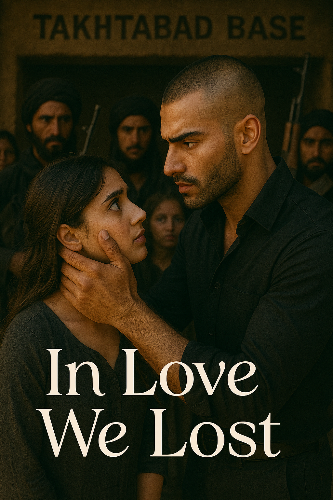

# Chapter 1: The Recognition

The heavy wooden door groaned open, casting a harsh rectangle of light across the dimly lit room. Dust motes danced in the stale air of the underground compound, somewhere deep in the mountains of Afghanistan. The acrid smell of gunpowder and fear hung thick in the atmosphere.

A group of young women huddled together in the corner, their eyes wide with terror. Armed militants surrounded them, AK-47s gleaming menacingly in the flickering light of oil lamps. The concrete walls seemed to close in on them, amplifying every whispered prayer and stifled sob.

Footsteps echoed down the corridor—measured, confident, commanding.

Then he entered.

The man who stepped through the doorway commanded attention without saying a word. His head was cleanly shaved, revealing a sharp jawline that led to a meticulously groomed beard. The buzz cut emphasized the angular features of his face, while his dark eyes held a coldness that seemed to pierce through steel. Everything about him radiated calculated menace—a handsome face twisted by something dark and unforgiving.

He surveyed the room with the detached interest of someone examining livestock. His gaze moved methodically from one terrified face to another, showing no emotion, no recognition, no humanity. The other militants straightened in his presence, their deference clear. This was their new commander.

But among the captives, one girl's breath caught in her throat.

Aanya's world tilted on its axis. The blood drained from her face as she stared at the man who had just entered—a man she had known long before he became this cold-eyed stranger. Her lips parted in a silent gasp, her mind struggling to reconcile the gentle boy she once knew with the monster standing before her.

*It can't be him. It can't be.*

But those eyes—despite their newfound cruelty, despite the years that had passed—she would recognize them anywhere. They belonged to someone who had once looked at her with love, with hope, with dreams of a future together.

Aarav.

Her college batchmate. Her friend. The boy who had loved her with a devotion that had frightened her in its intensity.

He moved through the room like a predator, issuing quiet commands to his men in a language she didn't understand. When his gaze finally fell on her, Aanya held her breath, waiting for even the flicker of recognition, a sign that somewhere beneath this hardened exterior, the boy she once knew still existed.

But there was nothing. His eyes passed over her as if she were a stranger, as if the years they had shared, the conversations, the laughter, the tears—as if none of it had ever happened. The indifference in his expression was more terrifying than any weapon.

Aanya pressed herself further into the shadows, her mind reeling. How had he come to be here? How had the boy who used to recite poetry and dream of coding projects become the commander of a terrorist cell?

As if sensing her stare, Aarav's eyes found hers again. For a split second, she thought she saw something flicker—a momentary crack in his armor. But it was gone so quickly she might have imagined it.

He turned away, barking orders to his subordinates, and Aanya was left to grapple with the impossible reality before her.

The boy who had once promised to always take care of her was now the very person she needed protection from.

The room began to blur as memories flooded back—college corridors filled with laughter, late-night conversations under starlit skies, the moment when everything between them had shattered beyond repair. How had love turned into this? How had rejection bred such darkness?

As Aarav disappeared through another doorway, his presence lingering like smoke in the air, Aanya closed her eyes and allowed herself to remember. She remembered when he was just Aarav—not a commander, not a terrorist, but simply a boy who had loved her more than she had ever deserved.

*What happened to you, Aarav? What did I do to you?*

The questions echoed in her mind as the harsh reality of her situation settled in. She was trapped in an Al-Qaeda compound, and the only person who might have once saved her was now the very one holding her captive.

The cruel irony wasn't lost on her—in trying to escape love, she had somehow found herself at its most twisted conclusion.

---

*Three years ago...*

The memory came flooding back with painful clarity. It was one of those warm college evenings when they used to walk together around the campus, just as friends. The air was filled with the scent of jasmine from the college gardens, and students were scattered across the lawns, some studying, others just enjoying the cool breeze.

"You know, I used to like Riya," Aarav had said suddenly, breaking their comfortable silence.

Aanya had looked at him with surprise. "Really? I thought that was just a rumor."

"It was just an infatuation for a few days, maybe weeks. Nothing serious," he had replied, his hands shoved deep in his pockets, his innocent eyes reflecting the campus lights.

She remembered how persistent she had been, driven by curiosity. "But who do you like now? I think you like someone else. Just tell me. I want to know. Please, please just tell me."

He had stopped walking then, turning to face her under the streetlight. His face was so young, so pure, so different from the hardened stranger she had just seen. "Her name is Aanya," he had whispered.

"What?" She had been genuinely shocked.

"Yeah, I like you. I love you, actually."

The confession had hit her like a thunderbolt. She remembered the way her heart had raced, not with joy but with panic. "Aarav, I... I'm not ready for a relationship."

His face had fallen, but he had tried to smile. "That's okay. I'll wait for you. I'll always be there for you, no matter what."

How caring he had been. How loving. How patient. And how foolishly she had rejected him, thinking she was too young for love, too focused on her career, too afraid of commitment.

*I was so stupid,* she thought now, tears streaming down her face. *I lost the love of my life because I was too scared to take a chance.*

"Aanya?"

The voice beside her made her return to the present. Her friend Aadyami, who was tied up next to her, was staring at her with concern.

"Why has your face suddenly gone pale? My instincts are telling me you know him from before. My instincts are never wrong."

Aanya quickly wiped her tears and shook her head. "No, I've never known him," she lied, her voice breaking.

But the tears wouldn't stop coming. The weight of recognition, of lost love, of what could have been, was crushing her.

After some time, when her sobs had quieted to silent tears, Aadyami spoke again in a whisper.

"He's looking dangerous, but he seems different from the other terrorists. You know, the ones with big beards, kurtas, and those hardened, weathered faces. But he... he's handsome and tall, and very young-looking. There's something about him that doesn't fit with the others."

Aanya closed her eyes, knowing exactly what her friend meant. Even in his transformation into this cold commander, traces of the gentle boy she once knew still lingered in his features. The boy who used to recite poetry, take care of her, give her flowers, who dreamed of coding projects and a future filled with hope with her.

The boy who had loved her unconditionally, and whom she had pushed away.

*What have I done to you, Aarav? What did my rejection turn you into?*

---

## The Next Day

The pale morning light filtered through the grimy windows of the mud-brick compound. Aanya had barely slept, her mind tormented by the impossible reality of seeing Aarav in this place, in this role. She had spent the night praying silently, desperately hoping that somehow the gentle, caring boy she once knew still existed beneath the cold exterior of the commander.

*Please, let him remember who he used to be. Let him remember the boy who used to recite poetry under the stars, who dreamed of changing the world with his code, who promised to always take care of me.*

The other captives huddled together in the cramped room on the second floor of the compound. The mud walls were thick but couldn't completely muffle the sounds from outside—the harsh voices of militants, the clanking of weapons, the general atmosphere of controlled chaos that seemed to permeate this place.

Aanya pressed her face close to the small window, trying to catch a glimpse of Aarav, hoping against hope to see some sign of the boy she once knew.

Suddenly, the sharp crack of gunfire shattered the morning silence.

All the girls scrambled to the window, their hearts racing with terror and morbid curiosity. What they saw below made Aanya's blood run cold.

A crowd had gathered in the courtyard. Two men were tied to wooden posts, their faces bloody and swollen from beatings. Between them lay a third man—motionless, a dark pool spreading beneath his head. The acrid smell of gunpowder drifted up to their window.

And there, standing in the center of it all with a smoking pistol in his hand, was Aarav.

"These dogs claimed to be simple traders," his voice carried up to them, cold and commanding. "But they were sending information to American intelligence. They thought they could infiltrate our operations."

The crowd of militants cheered and shouted their approval. Aarav's face was a mask of stone as he gestured to the surviving captives.

"This is what happens to spies. This is what happens to traitors. Let this be a lesson to anyone who thinks they can betray our cause."

Aanya's hands flew to her mouth, stifling a sob. The boy who used to quite when they watched sad movies, who used to wipe my tears when I cried, who couldn't even bring himself to step on an ant, had just executed a man in cold blood.

The crowd began to disperse, but Aarav's sharp eyes caught movement at the window above. His gaze traveled upward and locked directly onto the faces of the girls pressed against the glass.

"GET AWAY FROM THAT WINDOW!" his voice boomed across the courtyard with terrifying authority. After a long silence, two more gunshots rang out, and the remaining men slumped lifeless against their posts, blood staining the weathered wood.

The girls scrambled backward, but it was too late. Heavy footsteps thundered up the stairs, and within moments, the door burst open. Aarav stood in the doorway, his presence filling the small room with menace.

"I told you to stay away from the windows," he said, his voice deadly quiet. "Did you enjoy the show?"

His eyes swept across their terrified faces, lingering for just a moment longer on Aanya before moving on. If there was any recognition there, he buried it deep.

"Sit. Down. Now." Each word was delivered like a hammer blow.

The girls immediately complied, pressing themselves against the far wall.

"You see what happened to those men down there?" Aarav continued, his voice never rising but somehow more frightening for its calm control. "That will be your fate if you disobey our orders. If you try to escape. If you cause any trouble whatsoever."

He paced slowly in front of them, his boots echoing ominously on the floor.

"You are here for a reason. You will do as you're told, when you're told. You will not speak unless spoken to. You will not look out those windows again. And you will remember that your lives depend entirely on your obedience."

His gaze found Aanya again, and for just a split second, she thought she saw something flicker in his eyes—a ghost of recognition, a shadow of pain. But it was gone so quickly she might have imagined it.

"Am I understood?" he barked.

"Yes," the girls whispered in unison, their voices barely audible.

Aarav turned on his heel and strode toward the door, then paused.

"Oh, and ladies," he said without turning around, "if any of you are thinking of playing hero, remember this—I know exactly how to make death take a very, very long time."

The door slammed shut behind him, followed by the sound of a heavy lock clicking into place.

The moment he was gone, Aanya collapsed, her body shaking with silent sobs. The other girls tried to comfort her, but how could they understand? How could anyone understand what it felt like to watch the person you once loved—the person who once loved you more than life itself—transform into this monster?

"How could he change like this?" she whispered through her tears. "I'm scared because I'm trapped here, but I'm even more heartbroken for him. He was so good in college. So pure. So gentle."

Aadyami wrapped her arms around her friend. "People can change, Aanya. War, pain, betrayal—they can twist someone beyond recognition."

But Aanya shook her head. "You don't understand. This isn't just change. This is... this is destruction. Someone destroyed the beautiful soul he had and replaced it with this... this darkness."

*And I was part of that destruction,* she thought but couldn't bring herself to say aloud. *My rejection, my lies, my cruelty—did they help break him? Did they push him toward this path?*

Outside, the sounds of the compound continued—orders being barked, weapons being cleaned, the general bustle of a military operation. But all Aanya could hear was the echo of that gunshot and the memory of Aarav's cold, emotionless voice as he sentenced men to death.

The boy who once promised to always protect her had become the very person she now needed protection from. And somewhere in the twisted maze of fate and choices, love had transformed into its own darkest nightmare.

*What have we both become?* she wondered, staring at the locked door through which her former love had disappeared. *And is there any way back from this darkness?*

---

*To be continued...*
